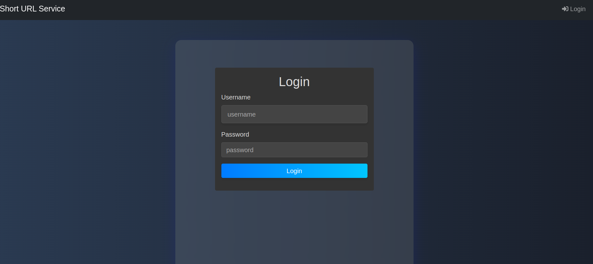
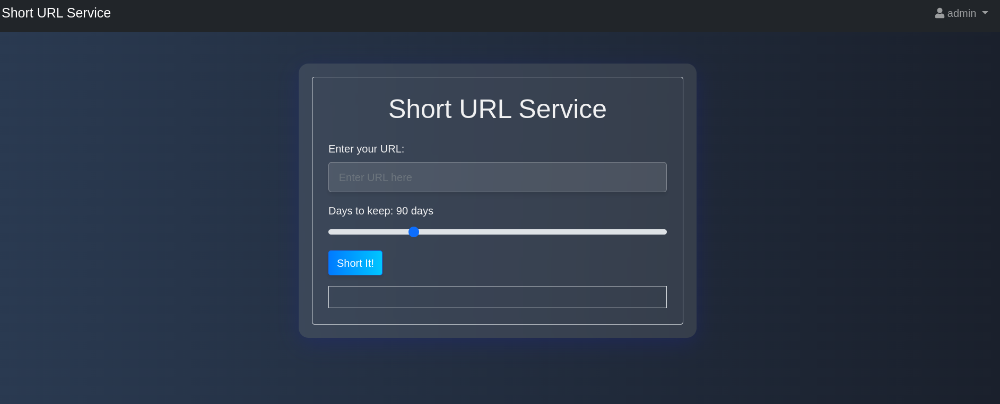
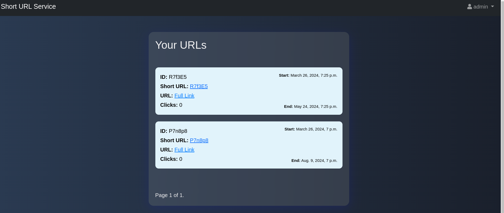

## URL Shortening Service

**Task:**  
Shorten long URLs to shorter ones without losing their value. This improves the readability of the link for the user.

**Main requirements for the service:**

- The service should transform the specified URL into a short one without cutting off its parameters;
- The short link should reliably redirect the user to the external URL within the timeframe specified by the user. The range is from 1 day to 1 year. By default, 90 days;
- The link should be as short as possible while maintaining its uniqueness within a million simultaneously stored links. A random number of links can be added every day, each of which can have its own lifespan;
- The service should have an API interface for interaction with programs.

## Stack:
- Django/Django REST Framework
- Python 

## Installation 

- Clone the repository


```bash
git clone https://github.com/ruslan-kornich/url_short_service_drf.git
```

- Create and activate a virtual environment:

```bash
$ python3 -m venv venv
$ source venv/bin/activate
```

- Install dependencies:

```bash
$ pip install -r requirements.txt
```

- Run the server:

```bash
$ python3 manage.py runserver
```
## Cron Job


```bash
$ python manage.py crontab add
```
his will start a task that will check and delete links from the database whose end date is approaching every hour.


**Access the admin panel at** 
admin/

**Username/password:**     
admin/admin

## Example Login Page



## Example Short URL page



## Example  of output of URLs stored in the database




## API:
Supports GET, POST, PUT, DELETE requests for interaction with applications

## Expected data structure

```jsx
// short_url - links are stored in the database
{
	id: 
	link: String
	short_link: String
	time_create: DateTime
        end_time: DateTime
}
```

### API Operation Description

#### GET /api/v1/urls/
```jsx
// Response
{
    "short_url": [
        {
            "id": 1,
            "link": "https://pypi.org/project/django-crontab/",
            "short_link": "H4s4d3",
            "time_create": "2022-11-04T16:15:53.842856",
            "end_time": "2022-11-05T16:15:53.841007"
        },
        {
            "id": 2,
            "link": "https://docs.python.org/3/tutorial/index.html",
            "short_link": "v8E2R8",
            "time_create": "2022-11-04T16:16:30.710958",
            "end_time": "2023-11-04T16:16:30.709688"
        },
	],
}
```
### POST /api/v1/urls/
```jsx
// Request Body
{
    "link" : "https://docs.djangoproject.com/en/4.1/topics/auth/passwords/",
    "end_time" : "2023-03-08T11:58:38.000315"
}
// Request Body
{
    "pk": 80,
    "link": "https://docs.djangoproject.com/en/4.1/topics/auth/passwords/",
    "short_link": "r7Q0W8",
    "time_create": "2022-12-10T17:42:34.045765",
    "end_time": "2023-03-08T11:58:38.000315"
}

```
### PUT /api/v1/urls/{id}
```jsx
// Request Body

{
    "link": "https://docs.djangoproject.com/en/4.1/topics/auth/passwords/tests",
    "end_time": "2024-03-08T11:58:38.000315"
}
// Ответ
{
    "pk": 80,
    "link": "https://docs.djangoproject.com/en/4.1/topics/auth/passwords/tests",
    "short_link": "r7Q0W8",
    "time_create": "2022-12-10T17:42:34.045765",
    "end_time": "2023-03-08T11:58:38.000315"
}
```
### DELETE /api/v1/urls/{id}
```jsx

// Response
"Link r7Q0W8 removed"
```

